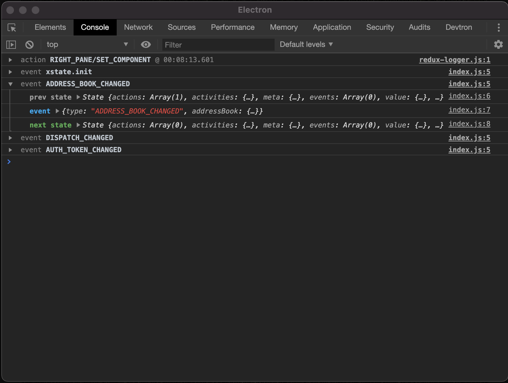

# xstate-logger

  

redux-logger but for XState

Please feel free to open issues to improve this logger.

## Quick Start

1. Install `xstate` and `xstate-logger`:

```bash
yarn add xstate xstate-logger
```

2. Import the `xstateLogger` function:

```ts
import { createMachine, interpret } from 'xstate';
import { xstateLogger } from 'xstate-logger';

// Stateless machine definition
// machine.transition(...) is a pure function used by the interpreter.
const toggleMachine = createMachine({
  id: 'toggle',
  initial: 'inactive',
  states: {
    inactive: { on: { TOGGLE: 'active' } },
    active: { on: { TOGGLE: 'inactive' } }
  }
});

// Machine instance with internal state
const toggleService = interpret(toggleMachine)
  .onTransition((state) => xstateLogger(state))
  .start();
// => 'event xstate.init'

toggleService.send('TOGGLE');
// => 'event TOGGLE'

toggleService.send('TOGGLE');
// => 'event TOGGLE'
```

## Usage with @xstate/react
1. Install `xstate`, `@xstate/react` and `xstate-logger`:

```bash
yarn add xstate @xstate/react xstate-logger
```

2. Import the `xstateLogger` function:

```ts
import { createMachine } from 'xstate';
import { useMachine } from '@xstate/react';
import { xstateLogger } from 'xstate-logger';

const toggleMachine = createMachine({
  id: 'toggle',
  initial: 'inactive',
  states: {
    inactive: {
      on: { TOGGLE: 'active' }
    },
    active: {
      on: { TOGGLE: 'inactive' }
    }
  }
});

export const Toggler = () => {
  const [state, send] = useMachine(toggleMachine);

  if (process.env.NODE_ENV !== 'production') {
    useEffect(() => {
      const subscription = service.subscribe(xstateLogger);
      return subscription.unsubscribe;
    }, [service]);
  }

  return (
    <button onClick={() => send('TOGGLE')}>
      {state.value === 'inactive'
        ? 'Click to activate'
        : 'Active! Click to deactivate'}
    </button>
  );
};
```
